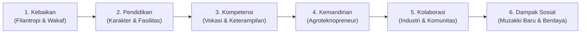

# Narasi Web Filantropi — Global Village Fund (GVF)
> **Master Blueprint & Arsitektur Konten Website**  
> Inisiatif di bawah Yayasan Permata Cendekia Indonesia (YPCI)  
> *Versi: 1.0 • Tanggal: 8 Oktober 2026*

---

## 1. Konsep First Screen (Hero Carousel 4 Slide)

Setiap slide mewakili dimensi pilar ekosistem pesantren yang saling terintegrasi, dengan foto autentik dan pesan yang terarah.

```
+-----------------------------------------------------------------------------------+
|  [SLIDE 1: Brand Utama]       Membangun Ekosistem Pesantren.                      |
|  [SLIDE 2: Pendidikan]        Menumbuhkan Potensi, Membangun Kemandirian.         |
|  [SLIDE 3: Masjid]            Satu Rumah Allah, Tumbuh Banyak Kebaikan.           |
|  [SLIDE 4: Kemandirian]       Dari Pesantren, Tumbuh Kemandirian.                 |
+-----------------------------------------------------------------------------------+
```

---

### Slide 1 — Brand Utama (Ekosistem & Kebermanfaatan)
* **Aset Visual:** Foto santri + kawasan pesantren / aktivitas santri di Jonggol.
* **Tagline Bahasa Inggris:**  
  *“Fostering Pesantren Ecosystems for Self-Reliance and Social Impact”*
* **Headline:**  
  **Membangun Ekosistem Pesantren.**  
  **Menghadirkan Kebermanfaatan.**
* **Sub-headline / Deskripsi:**  
  Global Village Fund adalah wadah kebaikan dan kolaborasi untuk memperkuat ekosistem pesantren menuju kemandirian dan dampak sosial.
* **Call to Action (CTA):**  
  * Tombol Utama: `[Jelajahi Program]` (Arahkan ke Section Program)  
  * Tombol Sekunder: `[Dukung Kebaikan]` (Arahkan ke Formulir / Rekening Donasi)  
  * Opsi Teks Singkat: `Kenali Kami | Lihat Program`

---

### Slide 2 — Pendidikan & Kompetensi
* **Aset Visual:** Foto santri sedang belajar di kelas, praktikum studio, atau workshop vokasi.
* **Headline:**  
  **Menumbuhkan Potensi,**  
  **Membangun Kemandirian.**
* **Sub-headline / Deskripsi:**  
  Mendukung pendidikan, pengembangan kompetensi, dan pembentukan karakter santri sebagai bekal untuk menghadapi masa depan.
* **Call to Action (CTA):**  
  * `[Lihat Program Pendidikan]`

---

### Slide 3 — Masjid Khairu Ummah Sugro
* **Aset Visual:** Foto arsitektur bangunan Masjid Khairu Ummah Sugro di kawasan Jonggol.
* **Headline:**  
  **Satu Rumah Allah,**  
  **Tumbuh Banyak Kebaikan.**
* **Sub-headline / Deskripsi:**  
  Bersama-sama menyelesaikan pembangunan Masjid Khairu Ummah Sugro sebagai bagian dari ekosistem pembelajaran dan kebermanfaatan pesantren.
* **Call to Action (CTA):**  
  * `[Dukung Pembangunan Masjid]`

---

### Slide 4 — Kemandirian & Lingkungan (Agro-Technopark)
* **Aset Visual:** Greenhouse, pertanian presisi, lahan hijau, kebun hortikultura, panel surya, aktivitas santri bertani.
* **Headline:**  
  **Dari Pesantren,**  
  **Tumbuh Kemandirian.**
* **Sub-headline / Deskripsi:**  
  Mengembangkan ekosistem pendidikan, lingkungan, dan kewirausahaan yang saling terhubung untuk menciptakan manfaat yang berkelanjutan.
* **Call to Action (CTA):**  
  * `[Jelajahi Ekosistem Mandiri]`

---

## 2. "Kenapa Global Village Fund?" (Ecosystem Thesis)

> *Prinsip: Jangan langsung melompat ke daftar program/donasi. Hadirkan bridging narasi mengapa pendekatan ekosistem ini penting.*

### Judul Section:
**Kebaikan yang Tumbuh Menjadi Ekosistem**

### Narasi Filosofis:
> "Kebaikan tidak berhenti pada satu bantuan. Ia dapat tumbuh menjadi pendidikan, kompetensi, kemandirian, dan kebermanfaatan yang dirasakan lebih luas."
> 
> "Global Village Fund hadir sebagai wadah kebaikan dan kolaborasi untuk mendukung penguatan ekosistem pesantren—menghubungkan pendidikan, pengembangan kompetensi, lingkungan, kemandirian, dan kebermanfaatan sosial."

### Metrik & Data Kunci (Clean Visual Stats):

| Angka / Simbol | Label Parameter | Keterangan Kontekstual |
| :---: | :--- | :--- |
| **`1`** | **Pilot Project** | Model percontohan ekosistem pesantren integratif holistik |
| **`±3 Ha`** | **Kawasan Pengembangan** | Lahan terpadu di Jonggol Bogor (Masjid, Sekolah, Technopark) |
| **`FAST`** | **Character Development** | Fondasi Fathonah, Amanah, Shiddiq, dan Tabligh |
| **`∞`** | **Potensi Kebermanfaatan** | Pahala jariyah dan dampak ekonomi yang terus berlipat ganda |

---

## 3. About Global Village Fund (Identitas & Lokasi Riil)

### Judul Section:
**Tentang Global Village Fund**

### Tagline Global:
*Fostering Pesantren Ecosystems for Self-Reliance and Social Impact*

### Deskripsi Institusional:
Global Village Fund merupakan wadah kebaikan dan kolaborasi di bawah **Yayasan Permata Cendekia Indonesia (YPCI)**, yang berfokus pada penguatan ekosistem pesantren menuju kemandirian dan dampak sosial.

Melalui pendekatan ekosistem, dukungan filantropi tidak hanya diarahkan pada satu kebutuhan sesaat, tetapi pada berbagai unsur yang saling mendukung:
1. **Pendidikan Formal & Diniyah**
2. **Pengembangan Kompetensi & Vokasi**
3. **Pembentukan Karakter Luhur**
4. **Kelestarian Lingkungan Hidup**
5. **Kemandirian Ekonomi Berbasis Agroteknologi**
6. **Kebermanfaatan Sosial bagi Warga Sekitar**

### Profil Lokasi Pilot Project:
* **Entitas:** Pesantren Integratif Holistik — SMK Skill Village Islamic School
* **Lokasi:** Desa Sukasirna, Kecamatan Jonggol, Kabupaten Bogor, Jawa Barat.
* **Elemen Visual:** Foto udara (aerial drone) lanskap kawasan masterplan 3 hektare.

---

## 4. "Our Approach" / Cara Kerja (Rantai Transformasi Nilai)

> *Tujuan Strategis: Memposisikan GVF sebagai pengembang ekosistem berjangka panjang, bukan sekadar platform penggalangan dana sesaat.*

### Judul Section:
**Dari Kebaikan Menjadi Kebermanfaatan**

### Diagram Rantai Nilai 6 Tahap:



### Proposisi Nilai Utama (Diferensiasi GVF):
> **“Kami percaya bahwa dukungan yang tepat dapat membangun kemampuan, bukan hanya memenuhi kebutuhan sesaat.”**

---

## 5. Program Kebaikan (Ecosystem Programs)

Setiap saluran kebaikan dirancang agar tidak berdiri sendiri, melainkan terhubung langsung dalam rantai penguatan ekosistem:

### 1. 🕌 Masjid & Rumah Kebaikan
* **Fokus:** Pembangunan Masjid Khairu Ummah Sugro
* **Deskripsi:** Pembangunan masjid tidak hanya sebagai ruang ibadah shalat berjamaah, melainkan sebagai pusat pembelajaran, pembinaan karakter, dan ruang kebermanfaatan bersama masyarakat.
* **Action:** `[Lihat Program & Salurkan Donasi]`

### 2. 🎓 Pendidikan Vokasi & Karakter (SMK Skill Village)
* **Fokus:** Beasiswa Pendidikan & Laboratorium Praktik Santri
* **Deskripsi:** Menghadirkan fasilitas pembelajaran vokasi integratif, workshop teknologi, dan kurikulum FAST agar santri siap memasuki dunia kerja profesional atau berwirausaha.
* **Action:** `[Dukung Beasiswa Santri]`

### 3. 🌱 Agro-Technopark & Ketahanan Pangan
* **Fokus:** Greenhouse, Pertanian Presisi, & Energi Bersih
* **Deskripsi:** Inkubasi bisnis santri di bidang pertanian terapan dan pemanfaatan energi surya untuk menopang kebutuhan pangan harian asrama serta kemandirian ekonomi pesantren.
* **Action:** `[Jelajahi Inisiatif Mandiri]`

### 4. 🤝 Kemitraan Multipihak (Kolaborasi Strategis)
* **Fokus:** Sinergi Lembaga, Dunia Usaha, & Akademisi
* **Deskripsi:** Membuka ruang kemitraan bagi korporasi (CSR), perguruan tinggi, dan muzakki institusi untuk mengembangkan model pemberdayaan pesantren di Indonesia.
* **Action:** `[Konsultasi Kemitraan]`

---

## 6. Panduan Implementasi Teknis & Desain (Design Directives)

1. **Prinsip Anti-Slop (antislop-ui):**
   * Hindari elemen dekoratif tanpa fungsi (tanpa glow sembarangan, tanpa deretan kapsul pelangi, tanpa garis aksen kiri sepihak).
   * Gunakan tipografi editorial yang berbobot (*Plus Jakarta Sans* & *Golos Text*) dengan kontras WCAG 2.2 AA.
2. **Prinsip TypeUI (typeui-fundamentals):**
   * Batasi lebar container di `1280px` pada desktop.
   * `line-height` pada judul display utama dikunci rapat (`1.04` - `1.08`) dengan margin bawah `32px`.
   * Tombol aksi berdampingan wajib memiliki tinggi seragam (`height: 50px` / `padding: 0 24px`).
3. **Palet Warna Dominan:**
   * Biru korporat berwibawa (`--gvf-navy-dark: #061829`, `--gvf-blue-vibrant: #0969da`, `--gvf-blue-royal: #0052cc`).
   * Bebas dari saturasi warna ungu sesuai preferensi brand.

