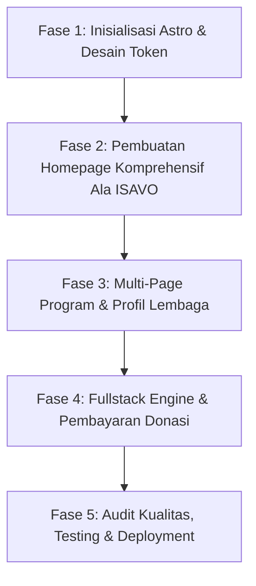

# Master Plan: Transformasi Website GVF Menjadi Portal Profil & Wakaf Profesional (Astro Fullstack)
**Referensi Desain**: Anatomi & Estetika Modern Clean ala ISAVO (`isavo.co.id`)  
**Stack Utama**: Astro 5 (Hybrid/SSR) + Vanilla/Scoped CSS Modern + PostgreSQL (Drizzle ORM) + Payment Gateway API  
**Target Estetika**: Ultra Clean, Modern Whitespace, Dominan Biru Korporat (`#0a2540`, `#0969da`), Tanpa Warna Ungu.

---

## 1. Ringkasan Eksekutif & Sasaran Transformasi
Mengubah basis landing page saat ini (`Wakaf-LP` berbasis Vite/HTML statis satu halaman) menjadi **Website Company Profile & Portal Filantropi Terpadu** untuk **Global Village Fund (GVF)**. Website ini menggabungkan:
1. **Kredibilitas Korporat & Lembaga**: Standar company profile profesional berorientasi transparansi dan trust.
2. **Katalog Program Wakaf Mandiri**: Setiap program memiliki halaman detail, target dana, dan laporan berkala.
3. **Fitur Interaktif & Fullstack**: Kalkulator simulasi wakaf, checkout pembayaran donasi instan (QRIS & VA), serta generator sertifikat wakaf digital otomatis.

---

## 2. Analisis & Adopsi Konsep Desain ISAVO (`isavo.co.id`)

### A. Struktur Navigasi & Header
- **Top Bar**: Nomor WhatsApp fast response, email resmi, dan alamat sekretariat nazhir.
- **Sticky Navbar dengan Efek Glassmorphism**:
  - Menu: Beranda, Pilar Program (Dropdown), Katalog Wakaf, Simulasi Wakaf, Tentang Kami, Laporan Transparansi, Berita.
  - Tombol Aksi Menonjol (*Standout CTA*): "Tunaikan Wakaf" & "Cek Donasi".
- **Mobile Drawer Navigasi**: Menu samping yang halus dan ringan saat dibuka di ponsel pintar.

### B. Anatomi Halaman Beranda (Homepage Layout)
1. **Hero Section**:
   - Tagline reputasi: `#WAKAFBERKELANJUTAN · GLOBAL VILLAGE FUND`.
   - Judul berbobot: *"Membangun Peradaban Berkelanjutan Melalui Wakaf Produktif & Pendidikan Berbasis Alam"*.
   - Dual CTA Button: *"Eksplorasi Program"* (Secondary) dan *"Salurkan Wakaf Sekarang"* (Primary Blue).
2. **3 Pilar Utama Lembaga (Cards Grid)**:
   - **Pendidikan**: *Skill Village Islamic School* (Pendidikan karakter & vokasi alam).
   - **Rumah Ibadah**: *Garden Mosque Khairu Ummah* (Pusat spiritual & ekologi komunitas).
   - **Lingkungan & Ketahanan**: *Green Waqf & Eco-Pesantren* (Agrikultur terintegrasi).
3. **4 Jaminan Kepercayaan (*Trust Badges*)**:
   - Terdaftar & Terstandarisasi Badan Wakaf Indonesia (BWI).
   - Diawasi Dewan Pengawas Syariah (DPS).
   - Laporan Penyaluran Transparan & Audit Finansial Terbuka.
   - Sertifikat Ikrar Wakaf Digital Resmi.
4. **Counter Metrik Interaktif (Dampak Nyata)**:
   - Angka bertumbuh: Total Wakaf Terhimpun (Rp), Luas Lahan Terbebaskan (m²), Jumlah Penerima Manfaat, Jumlah Wakif Terdaftar.
5. **Alur Wakaf Transparan (Numbered Step 01–04)**:
   - `01. Pilih Program` -> `02. Niat & Akad Wakaf` -> `03. Pembayaran Otomatis` -> `04. Terbit Sertifikat Digital & Laporan Progres`.
6. **Katalog Program Pilihan (Campaign Grid)**:
   - Kartu program dengan foto resolusi tinggi, persentase progress bar pencapaian dana, sisa hari, dan tombol donasi langsung.
7. **Simulasi & Kalkulator Wakaf Interaktif (Fitur Unggulan ala ISAVO)**:
   - Pilihan paket wakaf per meter / wakaf uang tunai / saham wakaf, dengan kalkulasi proyeksi manfaat jariyah berkelanjutan.
8. **Profil Dewan Pembina & Nazhir (*Leadership Section*)**:
   - Foto dan profil ringkas pengurus lembaga untuk menghadirkan sentuhan kepercayaan personal (*humanized trust*).
9. **Kabar Penyaluran & Laporan Progres Lapangan (*News & Impact Blog*)**:
   - Artikel dan dokumentasi foto sebelum-sesudah pembangunan.
10. **Footer Korporat Komprehensif**:
    - Legalitas lembaga, peta lokasi, kontak, rekening resmi, dan channel media sosial.

---

## 3. Arsitektur Teknis (Astro Fullstack)

### A. Struktur Direktori Proyek
```text
wakaf-lp/
├── public/                 # Asset statis, gambar, favicon, logo GVF
├── src/
│   ├── components/         # Komponen UI modular
│   │   ├── layout/         # Header, TopBar, Navbar, Footer, MobileNav
│   │   ├── home/           # Hero, Pillars, MetricsCounter, WorkflowSteps, TeamSection
│   │   ├── program/        # ProgramCard, ProgressBar, DonationWidget
│   │   ├── calculator/     # WakafCalculator (Interactive Island)
│   │   └── ui/             # Button, Badge, Modal, Card, Accordion
│   ├── layouts/            # BaseLayout.astro, ProgramLayout.astro
│   ├── pages/              # Routing Astro
│   │   ├── index.astro                 # Homepage utama ala ISAVO
│   │   ├── program/
│   │   │   ├── index.astro             # Katalog semua program
│   │   │   └── [slug].astro            # Detail program + donasi
│   │   ├── simulasi.astro              # Halaman kalkulator wakaf lengkap
│   │   ├── tentang-kami.astro          # Legalitas, visi-misi, pengurus
│   │   ├── transparansi.astro          # Laporan keuangan & audit
│   │   ├── kabar/
│   │   │   ├── index.astro             # Blog & dokumentasi lapangan
│   │   │   └── [slug].astro            # Detail artikel
│   │   ├── cek-wakaf.astro             # Cek riwayat donasi & invoice
│   │   └── api/                        # Fullstack Server Endpoints (SSR)
│   │       ├── donations/create.ts     # Generate invoice / transaksi
│   │       ├── donations/status.ts     # Polling / cek status pembayaran
│   │       ├── webhook/payment.ts      # Webhook callback Payment Gateway
│   │       └── certificate/[id].ts     # Generate Sertifikat Wakaf Digital
│   ├── lib/                # Konfigurasi database, helper mata uang, sanitasi
│   └── styles/             # Global CSS & Design Tokens
```

### B. Design System & Tokens (CSS Modern)
- **Primary Color**: `#0a2540` (Deep Corporate Navy)
- **Accent Color**: `#0969da` / `#1e6091` (Vibrant Blue & Royal Blue)
- **Success/Eco Accent**: `#10b981` (Forest Green untuk label program lingkungan & status sukses)
- **Backgrounds**: `#ffffff` (Card background & primary surface), `#f8fafc` (Section alternating background)
- **Border & Shadow**: `border: 1px solid rgba(15, 23, 42, 0.08)`, `box-shadow: 0 4px 20px -2px rgba(0, 0, 0, 0.05)`
- **Typography**: `Plus Jakarta Sans` atau `Inter` (Sans-Serif Clean & Professional)
- **Aturan Ketat**: Bebas warna ungu sesuai aturan user.

### C. Backend & Integrasi Transaksi (Fullstack Engine)
1. **Database Schema**:
   - `campaigns`: id, title, slug, target_amount, collected_amount, category, thumbnail, description.
   - `donations`: id, invoice_id, campaign_id, donor_name, donor_phone, donor_email, amount, payment_status, prayer/doa, is_anonymous, created_at.
   - `updates`: id, campaign_id, title, content, image_url, date.
2. **Payment Gateway**:
   - Integrasi Midtrans / Xendit / Tripay (Mendukung QRIS instan, Bank Virtual Account BSI/BCA/Mandiri).
   - Webhook otomatis meng-update status `collected_amount` dan mengirimkan tanda terima digital.
3. **Sertifikat Wakaf Digital**:
   - Otomatis menerbitkan dokumen PDF tanda terima ikrar wakaf ber-QR Code validasi.

---

## 4. Rencana Eksekusi Bertahap (Roadmap 5 Fase)



### Tahap 1: Inisialisasi Proyek Astro & Design Tokens
- Pasang Astro dengan TypeScript & adapter SSR.
- Migrasi aset gambar, logo GVF, font, dan favicon ke struktur Astro.
- Konfigurasi `src/styles/design-tokens.css` (Palet Biru Modern, Clean Whitespace).
- Bangun layout dasar (`BaseLayout.astro`, `Header.astro`, `Footer.astro`).

### Tahap 2: Pembuatan Homepage Super-Clean Ala ISAVO
- Bangun komponen TopBar & Sticky Glassmorphism Header.
- Hero Section dengan positioning GVF & dual CTA.
- 3 Pilar Program Utama GVF.
- Trust Badges (Legalitas BWI & DPS).
- Counter Metrik Real-time.
- Step-by-Step Alur Wakaf (01–04).
- Showcase Katalog Program & Progress Bar.
- Section Profil Dewan Pembina/Nazhir.
- Section Kabar Lapangan & Testimoni.

### Tahap 3: Halaman Multi-Page Terstruktur
- Buat halaman `/program/skill-village-islamic-school` dan `/program/garden-mosque-khairu-ummah`.
- Buat halaman `/tentang-kami` (Legalitas, Visi-Misi, Profil Pengurus).
- Buat halaman `/simulasi` (Kalkulator Wakaf Interaktif).
- Buat halaman `/transparansi` (Download Laporan Keuangan Tahunan).
- Buat halaman `/kabar` (Dokumentasi berita lapangan).

### Tahap 4: Fullstack Endpoints & Integrasi Transaksi
- Setup skema database & koneksi repository data.
- Buat API endpoint `/api/donations/create` & integrasi mockup/live Payment Gateway.
- Buat modal form donasi cepat dengan pilihan metode bayar QRIS & Virtual Account.
- Buat halaman `/cek-wakaf` untuk mengecek status dan mengunduh sertifikat ikrar wakaf.

### Tahap 5: Audit, QA & Final Polish
- Uji performa Google Lighthouse / Core Web Vitals (target skor > 95).
- Uji responsivitas mobile di berbagai resolusi layar.
- Uji alur form transaksi, validasi input, dan keamanan CSRF/XSS.
- Siapkan skrip build dan konfigurasi deploy produksi.
