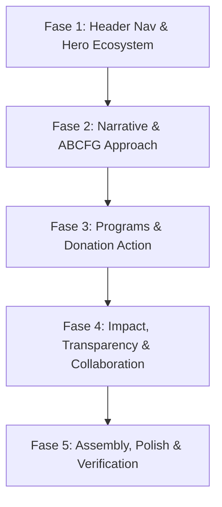

# BLUEPRINT KONTEN & STRUKTUR HALAMAN UTAMA (HOME)
## GLOBAL VILLAGE FUND (GVF) — YAYASAN PERMATA CENDEKIA INDONESIA (YPCI)

> **Dokumen Referensi**: Struktur Seksi Tambahan & Alur Konten Halaman Utama  
> **Tanggal Rilis**: 8 Oktober 2026  
> **Tujuan**: Acuan arsitektur informasi, copywriting naratif, dan pembagian seksi interaktif pada landing page utama Global Village Fund berbasis standar UI/UX modern ala ISAVO.

---

## 1. STRUKTUR NAVIGASI UTAMA (HEADER)

### Menu Navigasi
- **Home**
- **Tentang Kami**
- **Program**
- **Donasi**
- **Zakat**
- **Wakaf**
- **Kemitraan**
- **Dampak**
- **Kontak**

### Primary Call To Action (Paling Menonjol)
- **Tombol**: `DONASI SEKARANG` (Pill button kontras tinggi dengan animasi interaktif).

---

## 2. SUSUNAN 13 SEKSI KONTEN HALAMAN UTAMA

### 01 — HERO & QUICK ACTIONS
- **Headline Utama**: *Kebaikan yang Tumbuh Menjadi Kebermanfaatan*
- **Sub-headline & Narasi**:  
  > Global Village Fund adalah wadah kebaikan dan kolaborasi yang dikembangkan oleh Yayasan Permata Cendekia Indonesia untuk membangun ekosistem pesantren yang mandiri, berkarakter, terampil, dan memberikan dampak nyata bagi masyarakat.  
  > Melalui donasi, zakat, wakaf, dan kemitraan, setiap dukungan diarahkan untuk memperkuat pendidikan, pengembangan kompetensi, kemandirian, serta keberlanjutan ekosistem pesantren.
- **Call to Action**:
  - `[ Donasi Sekarang ]` (Tombol Utama)
  - `[ Lihat Program ]` (Tombol Sekunder / Outline Pill)
- **Quick Action Bar (Salurkan Kebaikan Anda)**:
  1. **DONASI**: Bantu kebutuhan program dan pembangunan yang sedang berjalan.
  2. **ZAKAT**: Tunaikan zakat melalui layanan yang dikelola YPCI.
  3. **WAKAF**: Bangun aset yang memberikan manfaat berkelanjutan.
  4. **KEMITRAAN**: Tumbuh bersama melalui kolaborasi strategis.

---

### 02 — WHO WE ARE
- **Headline**: *Satu Wadah Kebaikan. Banyak Jalan untuk Memberi Dampak.*
- **Refleksi Naratif**:
  - Ada yang hadir melalui sedekah.
  - Ada yang tumbuh melalui wakaf.
  - Ada yang diwujudkan melalui pendidikan.
  - Ada yang hadir melalui fasilitas.
  - Ada pula yang berkembang melalui kemitraan.
- **Pernyataan Misi**:  
  > Global Village Fund hadir untuk mempertemukan berbagai bentuk kebaikan tersebut dengan kebutuhan nyata di lapangan.  
  > Sebagai bagian dari Yayasan Permata Cendekia Indonesia, Global Village Fund berfokus pada pengembangan ekosistem pesantren yang mengintegrasikan iman dan karakter, pendidikan, keterampilan, pengalaman nyata, kemandirian ekonomi, dan kolaborasi multipihak.

---

### 03 — WHY WE EXIST
- **Headline**: *Masih Banyak Potensi yang Belum Menjadi Kesempatan.*
- **Fakta Data & Realitas**:  
  > Pesantren memiliki basis sosial yang besar. Indonesia memiliki **42.849 pesantren** dengan sekitar **6,3 juta santri** berdasarkan data Kementerian Agama. Namun, pendidikan, karakter, keterampilan, dan dunia kerja masih sering berjalan dalam ruang yang terpisah.
- **Transformasi Nilai**:
  - Kami tidak ingin kebaikan berhenti pada bantuan sesaat.
  - Kami ingin dukungan yang diberikan dapat ikut membangun ruang belajar, keterampilan, pengalaman, kemandirian, dan kesempatan untuk tumbuh.
  - Dari bantuan $\rightarrow$ menjadi **kesempatan**.
  - Dari fasilitas $\rightarrow$ menjadi **pembelajaran**.
  - Dari dukungan $\rightarrow$ menjadi **kebermanfaatan**.

---

### 04 — OUR APPROACH
- **Headline**: *Kami Membangun Ekosistem, Bukan Sekadar Menjalankan Program.*
- **Konsep Arsitektur**:  
  Di dalam ekosistem yang kami bangun, berbagai unsur saling terhubung melalui model **ABCFG** (*Academy, Business, Community, Family, Government*) yang berpusat pada masjid:
  1. **MASJID**: Iman, ibadah & karakter.
  2. **PENDIDIKAN**: Ilmu & pembelajaran.
  3. **KETERAMPILAN**: Kompetensi & pengalaman.
  4. **USAHA**: Praktik & kemandirian.
  5. **KELUARGA & KOMUNITAS**: Dukungan & kolaborasi.
  6. **INDUSTRI**: Pengalaman dunia nyata.
  7. **PEMERINTAH & MITRA**: Penguatan regulasi & ekosistem.

---

### 05 — WHERE YOUR SUPPORT GOES
- **Poin Filosofis**: Menjawab pertanyaan mendasar donatur: *“Kalau saya berdonasi, sebenarnya untuk apa?”*
- **Headline**: *Setiap Kebaikan Memiliki Tujuan.*
- **Alokasi & Fokus Dampak**:
  1. **Pendidikan**: Mendukung pengembangan pembelajaran dan kompetensi santri.
  2. **Fasilitas**: Membangun dan melengkapi ruang serta sarana yang menunjang aktivitas pendidikan dan kepesantrenan.
  3. **Keterampilan**: Mendukung pengembangan skill, *teaching factory*, laboratorium, dan pengalaman praktik.
  4. **Kemandirian**: Mengembangkan unit usaha dan aset produktif yang mendukung keberlanjutan ekosistem.
  5. **Wakaf Produktif**: Membangun aset yang memiliki nilai manfaat dan potensi keberlanjutan ekonomi.
  6. **Pemberdayaan**: Membuka ruang kolaborasi dan kesempatan agar santri serta masyarakat dapat berkembang.

---

### 06 — OUR PROGRAMS
- **Headline**: *Program yang Bisa Anda Dukung*
- **Format UI/UX**: Grid kartu interaktif yang dapat diklik langsung:
  1. **🕌 Masjid Khairu Ummah Sugro**  
     Mendukung pembangunan dan pengembangan masjid sebagai bagian dari pusat aktivitas kepesantrenan dan ekosistem pembelajaran.  
     `[ Dukung Program ]`
  2. **🎓 Pendidikan & Pengembangan Kompetensi**  
     Mendukung pengembangan santri melalui pendidikan vokasi, *teaching factory*, fasilitas pembelajaran, dan pengembangan keterampilan.  
     `[ Lihat Program ]`
  3. **🌱 Wakaf Produktif**  
     Membangun aset produktif yang dapat memberikan manfaat ekonomi dan mendukung keberlanjutan ekosistem.  
     `[ Wakaf Sekarang ]`
  4. **💡 Pengembangan Skill & Teaching Factory**  
     Mendukung ruang belajar berbasis praktik melalui pengembangan kompetensi di bidang pertanian, teknologi, konstruksi, dan bisnis digital (4 pilar ekosistem YPCI).  
     `[ Lihat Ekosistem ]`

---

### 07 — DONATION
- **Headline**: *Anda Tidak Harus Menunggu untuk Berbuat Baik.*
- **Sub-headline**: *Ada banyak cara untuk mengambil bagian.*
- **Pilihan Saluran**:
  - **INFAK & SEDEKAH**: Untuk mendukung kebutuhan dan program kebaikan yang sedang berjalan.
  - **ZAKAT**: Salurkan zakat melalui layanan YPCI sesuai peruntukannya.
  - **WAKAF UANG**: Bangun manfaat yang dapat terus berkembang melalui wakaf.
  - **DONASI BARANG / FASILITAS**: Dukungan dalam bentuk barang dan kebutuhan program.
  - **KEMITRAAN**: Dukungan dalam skala yang lebih luas melalui kolaborasi strategis.
- **CTA**: `[ Pilih Cara Anda Berkontribusi ]`

---

### 08 — FEATURED CAMPAIGN
- **Headline**: *Bantu Menyelesaikan Masjid Khairu Ummah Sugro*
- **Nilai Esensial**:  
  *Satu bangunan. Satu ruang ibadah. Satu pusat kebaikan bagi ekosistem pesantren.*
- **Komponen Interaktif**:
  - Progress bar dinamis: `Rp XX.XXX.XXX terkumpul dari target Rp X.XXX.XXX.XXX`
- **CTA**:
  - `[ Donasi Sekarang ]`
  - `[ Lihat Detail Campaign ]`

---

### 09 — WAKAF
- **Headline**: *Wakaf Hari Ini. Manfaat untuk Hari Esok.*
- **Narasi Makna**:  
  > Wakaf bukan hanya tentang memberi. Wakaf adalah tentang menghadirkan aset yang terus memberikan manfaat. Melalui Wakaf Produktif, dukungan masyarakat diarahkan untuk membangun aset yang dapat memperkuat keberlanjutan pendidikan, pesantren, dan kegiatan produktif.
- **Kategori Akad Wakaf**:
  1. **Wakaf Uang**: Cara mudah untuk mengambil bagian dalam pembangunan aset wakaf.
  2. **Wakaf Pembangunan**: Mendukung pembangunan sarana yang menjadi bagian dari ekosistem pesantren.
  3. **Wakaf Fasilitas**: Mendukung penyediaan fasilitas yang digunakan untuk ibadah, pendidikan, dan aktivitas pesantren.
- **CTA**: `[ Wakaf Sekarang ]`

---

### 10 — IMPACT
- **Headline**: *Ketika Kebaikan Bertumbuh, Dampaknya Ikut Meluas.*
- **Rantai Nilai (Value Chain Diagram)**:  
  `DONASI` $\rightarrow$ `FASILITAS & PROGRAM` $\rightarrow$ `PEMBELAJARAN` $\rightarrow$ `KETERAMPILAN & PENGALAMAN` $\rightarrow$ `KEMANDIRIAN` $\rightarrow$ `DAMPAK`
- **Penerima Manfaat Multipihak**:
  - **Untuk Santri**: Ilmu, karakter, keterampilan & pengalaman.
  - **Untuk Pesantren**: Ekosistem pendidikan yang lebih kuat dan berkelanjutan.
  - **Untuk Masyarakat**: Peluang kolaborasi, pemberdayaan, dan pertumbuhan ekonomi.
  - **Untuk Mitra**: Ruang kolaborasi yang menghasilkan dampak nyata.
- **Karakter Lulusan YPCI**: Membentuk generasi *Alim, FAST (Fathanah, Amanah, Siddiq, Tabligh), Kompeten, dan Kontributif*.

---

### 11 — TRANSPARENCY
- **Headline**: *Kepercayaan Dibangun dengan Keterbukaan.*
- **Prinsip**:  
  > Kami percaya bahwa setiap amanah harus dapat dipertanggungjawabkan. Karena itu, kami berkomitmen untuk menyampaikan perkembangan program, penggunaan dukungan, serta dokumentasi kegiatan secara terbuka dan bertanggung jawab.
- **CTA**:
  - `[ Lihat Laporan ]`
  - `[ Lihat Dokumentasi ]`

---

### 12 — COLLABORATE (STAKEHOLDER ECOSYSTEM)
- **Headline**: *Tidak Semua Orang Memberi dengan Cara yang Sama.*
- **Bentuk Kontribusi**:
  *Ada yang memberikan dana, ilmu, fasilitas, jaringan, serta waktu dan keahlian. Semuanya dapat menjadi bagian dari ekosistem.*
- **Matriks Mitra Pemangku Kepentingan**:
  1. **Perguruan Tinggi**: Ilmu, riset & pengembangan kompetensi.
  2. **Perusahaan**: Keahlian, teknologi, fasilitas & akses industri.
  3. **Funding Partner**: Pendanaan dan dukungan keberlanjutan.
  4. **Pemerintah**: Program, regulasi, fasilitasi & penguatan ekosistem.
  5. **Masyarakat**: Dukungan, relawan, mentoring & kolaborasi.
- **CTA**: `[ Bangun Kemitraan ]`

---

### 13 — FINAL CTA & BRAND CLOSING
- **Penutup**:  
  > *Satu kebaikan bisa menjadi awal dari banyak kebaikan.*  
  > *Mari bersama membangun ekosistem yang membuat pendidikan menjadi kesempatan, keterampilan menjadi kemandirian, dan kebaikan menjadi kebermanfaatan yang terus tumbuh.*
- **Tagline Resmi**:  
  **Global Village Fund**  
  *Fostering Pesantren Ecosystems for Self-Reliance & Social Impact*  
  *Wadah Kebaikan dan Kolaborasi: Donasi • Zakat • Wakaf • Kemitraan*

---

## 3. RENCANA IMPLEMENTASI BERTAHAP (ROADMAP FASE & TASK)

Berikut adalah pembagian pengerjaan terstruktur menjadi 5 Fase dan 16 Task atomik untuk mempermudah eksekusi dan pengujian:

### 🔹 FASE 1: Header Navigation & Hero Ecosystem
Fokus: Memperbarui pondasi navigasi utama dan kesan visual pertama (above-the-fold) agar pengunjung langsung memahami nilai GVF.

- [ ] **Task 1.1: Pembaruan Menu & CTA Navigasi Utama**
  - **File Target**: `src/components/layout/Navbar.astro`
  - **Detail**:
    - Perbarui daftar link desktop & drawer mobile: `Home`, `Tentang Kami`, `Program`, `Donasi`, `Zakat`, `Wakaf`, `Kemitraan`, `Dampak`, `Kontak`.
    - Ganti tombol CTA samping menjadi **`DONASI SEKARANG`** dengan gaya pill kontras tinggi dan efek hover halus.
  - **Kriteria Selesai**: Seluruh link navigasi sesuai blueprint dan anchor dapat diakses di desktop maupun mobile.

- [ ] **Task 1.2: Refactor Hero Section dengan Copywriting Baru**
  - **File Target**: `src/components/home/HeroSection.astro`
  - **Detail**:
    - Terapkan headline: *"Kebaikan yang Tumbuh Menjadi Kebermanfaatan"*.
    - Terapkan narasi YPCI tentang ekosistem pesantren mandiri.
    - Sediakan 2 tombol aksi: `[ Donasi Sekarang ]` (primer) dan `[ Lihat Program ]` (outline pill).
  - **Kriteria Selesai**: Tipografi tajam, kontras jernih di atas visual arsitektur, dan tombol aksi terhubung ke anchor yang tepat.

- [ ] **Task 1.3: Pembuatan Quick Action Cards Bar**
  - **File Target**: Komponen baru `src/components/home/QuickActionBar.astro`
  - **Detail**:
    - Buat 4 kartu aksi cepat floating tepat di bawah hero:
      1. **DONASI**: Kebutuhan program & pembangunan berjalan.
      2. **ZAKAT**: Tunaikan zakat terkelola YPCI.
      3. **WAKAF**: Bangun aset manfaat berkelanjutan.
      4. **KEMITRAAN**: Kolaborasi strategis.
  - **Kriteria Selesai**: Kartu responsif (1 kolom di mobile, 4 kolom di desktop) dengan ikon elegan dan tautan langsung.

---

### 🔹 FASE 2: Identitas, Masalah & Pendekatan Ekosistem (Section 02 - 05)
Fokus: Membangun kedalaman narasi, menyajikan data urgensi sosial pesantren, dan memperkenalkan model ekosistem ABCFG.

- [ ] **Task 2.1: Komponen 02 — Who We Are**
  - **File Target**: `src/components/home/WhoWeAreSection.astro`
  - **Detail**:
    - Layout split minimalis: Headline *"Satu Wadah Kebaikan. Banyak Jalan untuk Memberi Dampak"*.
    - Tampilan list reflektif (sedekah, wakaf, pendidikan, fasilitas, kemitraan) dengan aksen visual halus.
    - Narasi posisi GVF di bawah naungan YPCI.
  - **Kriteria Selesai**: Narasi terbaca mengalir dengan tipografi modern dan visual yang tenang.

- [ ] **Task 2.2: Komponen 03 — Why We Exist (Data & Urgensi)**
  - **File Target**: `src/components/home/WhyWeExistSection.astro`
  - **Detail**:
    - Headline: *"Masih Banyak Potensi yang Belum Menjadi Kesempatan"*.
    - Kartu stat data Kemenag: **42.849 Pesantren** & **6,3 Juta Santri**.
    - Diagram alur transformasi nilai: *Bantuan → Kesempatan → Pembelajaran → Kebermanfaatan*.
  - **Kriteria Selesai**: Data angka tersorot menonjol dengan animasi count/reveal saat masuk viewport.

- [ ] **Task 2.3: Komponen 04 — Our Approach (Ekosistem ABCFG)**
  - **File Target**: `src/components/home/OurApproachSection.astro`
  - **Detail**:
    - Headline: *"Kami Membangun Ekosistem, Bukan Sekadar Menjalankan Program"*.
    - Visual interaktif model ABCFG yang berpusat pada **Masjid** (Masjid, Pendidikan, Keterampilan, Usaha, Keluarga, Industri, Pemerintah).
  - **Kriteria Selesai**: 7 elemen ekosistem tersusun dalam diagram kluster yang mudah dipahami di mobile dan desktop.

- [ ] **Task 2.4: Komponen 05 — Where Your Support Goes**
  - **File Target**: `src/components/home/WhereSupportGoesSection.astro`
  - **Detail**:
    - Headline: *"Setiap Kebaikan Memiliki Tujuan"*.
    - 6 kartu alokasi: *Pendidikan, Fasilitas, Keterampilan, Kemandirian, Wakaf Produktif, Pemberdayaan*.
  - **Kriteria Selesai**: Desain kartu bersih, menjelaskan secara transparan ke mana dana disalurkan.

---

### 🔹 FASE 3: Program & Saluran Aksi Filantropi (Section 06 - 09)
Fokus: Memberikan pilihan aksi konkrit bagi donatur, mulai dari program terpilih, simulasi/saluran donasi, hingga kampanye unggulan.

- [ ] **Task 3.1: Komponen 06 — Our Programs (4 Interactive Cards)**
  - **File Target**: `src/components/home/OurProgramsSection.astro`
  - **Detail**:
    - Grid 4 kartu program interaktif:
      1. 🕌 Masjid Khairu Ummah Sugro
      2. 🎓 Pendidikan & Pengembangan Kompetensi
      3. 🌱 Wakaf Produktif
      4. 💡 Pengembangan Skill & Teaching Factory
    - Tiap kartu dilengkapi foto/render arsitektur, deskripsi ringkas, dan tombol tautan detail.
  - **Kriteria Selesai**: Kartu memiliki efek hover halus ala ISAVO dengan tombol panah responsif.

- [ ] **Task 3.2: Komponen 07 — Donation Channels**
  - **File Target**: `src/components/home/DonationChannelsSection.astro`
  - **Detail**:
    - Headline: *"Anda Tidak Harus Menunggu untuk Berbuat Baik"*.
    - Pilihan tab/grid 5 saluran: *Infak & Sedekah, Zakat, Wakaf Uang, Donasi Barang/Fasilitas, Kemitraan*.
    - CTA pemantik: `[ Pilih Cara Anda Berkontribusi ]`.
  - **Kriteria Selesai**: Memudahkan donatur memilih instrumen filantropi sesuai preferensi.

- [ ] **Task 3.3: Komponen 08 — Featured Campaign (Masjid Khairu Ummah)**
  - **File Target**: `src/components/home/FeaturedCampaignSection.astro`
  - **Detail**:
    - Headline: *"Bantu Menyelesaikan Masjid Khairu Ummah Sugro"*.
    - Progress bar interaktif penghimpunan donasi (Terkumpul vs Target).
    - Dua tombol aksi: `[ Donasi Sekarang ]` dan `[ Lihat Detail Campaign ]`.
  - **Kriteria Selesai**: Progress bar beranimasi halus saat di-scroll dan menyajikan data dana riil/transparan.

- [ ] **Task 3.4: Komponen 09 — Wakaf Pillars**
  - **File Target**: `src/components/home/WakafPillarsSection.astro`
  - **Detail**:
    - Headline: *"Wakaf Hari Ini. Manfaat untuk Hari Esok"*.
    - Narasi aset abadi berkelanjutan.
    - 3 pilar: *Wakaf Uang, Wakaf Pembangunan, Wakaf Fasilitas*.
  - **Kriteria Selesai**: Tampilan kartu kokoh dengan penekanan pada status wakaf produktif & AIW resmi.

---

### 🔹 FASE 4: Rantai Dampak, Transparansi & Kemitraan (Section 10 - 13)
Fokus: Membuktikan akuntabilitas, menyajikan dampak jangka panjang, dan mengundang keterlibatan mitra strategis.

- [ ] **Task 4.1: Komponen 10 — Impact Value Chain**
  - **File Target**: `src/components/home/ImpactValueChainSection.astro`
  - **Detail**:
    - Rantai alur horizontal: `DONASI → FASILITAS & PROGRAM → PEMBELAJARAN → KETERAMPILAN → KEMANDIRIAN → DAMPAK`.
    - 4 tab/kotak dampak multipihak (*Santri, Pesantren, Masyarakat, Mitra*).
    - Ringkasan karakter santri: *Alim, FAST, Kompeten, Kontributif*.
  - **Kriteria Selesai**: Visual diagram dampak mudah dibaca dan intuitif di semua ukuran layar.

- [ ] **Task 4.2: Komponen 11 — Transparency & Governance**
  - **File Target**: `src/components/home/TransparencySection.astro`
  - **Detail**:
    - Headline: *"Kepercayaan Dibangun dengan Keterbukaan"*.
    - Ringkasan komitmen pertanggungjawaban amanah.
    - Tombol aksi: `[ Lihat Laporan ]` dan `[ Lihat Dokumentasi ]`.
  - **Kriteria Selesai**: Menumbuhkan keyakinan donatur institusi maupun perorangan.

- [ ] **Task 4.3: Komponen 12 — Collaborate / Stakeholder Matrix**
  - **File Target**: `src/components/home/CollaborateSection.astro`
  - **Detail**:
    - Headline: *"Tidak Semua Orang Memberi dengan Cara yang Sama"*.
    - Matriks peran 5 mitra: *Perguruan Tinggi, Perusahaan, Funding Partner, Pemerintah, Masyarakat*.
    - Tombol: `[ Bangun Kemitraan ]`.
  - **Kriteria Selesai**: Desain grid bersih dengan ikon spesifik untuk masing-masing tipe mitra.

- [ ] **Task 4.4: Komponen 13 — Final CTA & Closing**
  - **File Target**: `src/components/home/FinalCtaSection.astro`
  - **Detail**:
    - Banner penutup estetis bertema dark luxury/royal blue.
    - Pesan penutup: *"Satu kebaikan bisa menjadi awal dari banyak kebaikan"*.
    - Brand closing tagline: *Global Village Fund — Fostering Pesantren Ecosystems for Self-Reliance & Social Impact*.
  - **Kriteria Selesai**: CTA penutup memiliki bobot visual kuat sebelum footer.

---

### 🔹 FASE 5: Perakitan Halaman Utama, Polishing & Verifikasi Akhir
Fokus: Menghubungkan seluruh komponen ke `index.astro`, memastikan performa dan responsivitas.

- [ ] **Task 5.1: Assembly Seluruh Seksi ke `src/pages/index.astro`**
  - **Detail**: Menyusun urutan 13 komponen di dalam `BaseLayout` sesuai struktur blueprint.
- [ ] **Task 5.2: Integrasi Animasi Scroll GSAP & Lenis**
  - **Detail**: Menyelaraskan efek stagger `.reveal-on-scroll` pada setiap kartu agar terasa seragam dan mewah seperti ISAVO.
- [ ] **Task 5.3: Pengujian Responsif (Mobile, Tablet, Desktop)**
  - **Detail**: Memastikan seluruh kartu, diagram, dan teks tidak ada yang overflow atau bertumpuk.
- [ ] **Task 5.4: Validasi Build Produksi**
  - **Detail**: Menjalankan `pnpm run build` dan memverifikasi tidak ada peringatan TypeScript maupun styling yang rusak.

